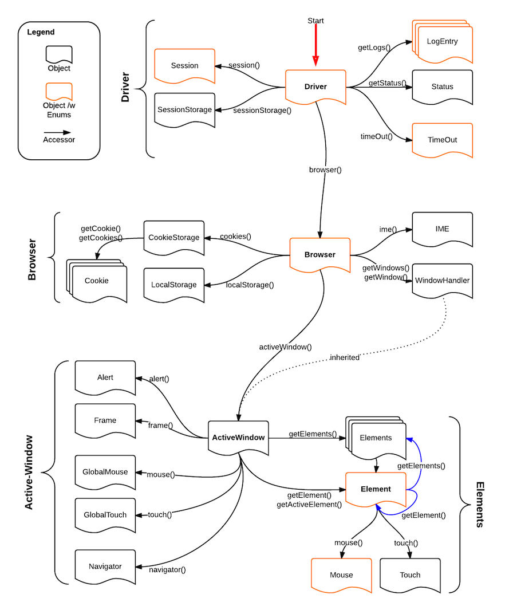

# Cabbie

A node web-driver client

[](https://travis-ci.org/ForbesLindesay/cabbie)
[](https://saucelabs.com/u/cabbie)
[](https://david-dm.org/ForbesLindesay/cabbie)
[](https://www.npmjs.com/package/cabbie)

## Installation

    npm install cabbie

## Usage

See "docs/api" for full API reference.

```js
var assert = require('assert');
var cabbie = require('cabbie');

var driver = cabbie('http://localhost:4444/wd/hub', { browserName:'firefox' }, { mode: cabbie.Browser.MODE_SYNC });
var browser = driver.browser();
var activeWindow = browser.activeWindow();

// Set url and assert a header-text
activeWindow.navigator().setUrl('http://www.example.com');
assert.equal(activeWindow.getElement('h1').getText(), 'Example Domain');

// Click on element
activeWindow.getElement('h1').mouse().click();

// Click on a specific coordinate
activeWindow.mouse().clickAt(500, 200);

// Close active window
activeWindow.close();

driver.dispose();
```

## Object Reference




## License

  MIT


## Attribution
<div>Icon made by <a href="http://www.icons8.com" title="Icons8">Icons8</a> from <a href="http://www.flaticon.com" title="Flaticon">www.flaticon.com</a> is licensed under <a href="http://creativecommons.org/licenses/by/3.0/" title="Creative Commons BY 3.0">CC BY 3.0</a></div>
